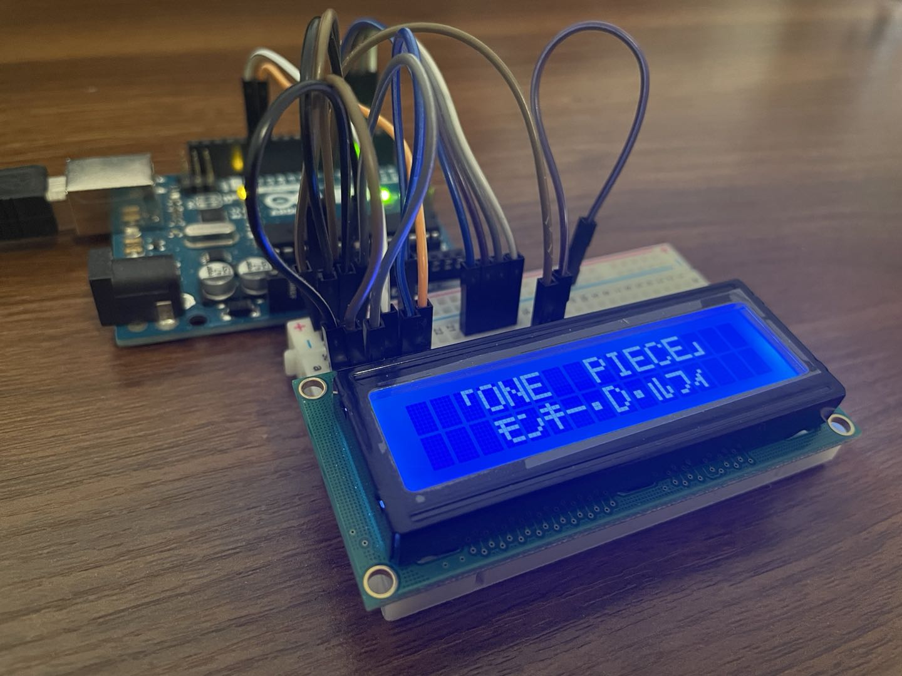

## Arduino library for printing Japanese Katakana on LCD

This library supports printing the [Japanese Katakana
characters](https://en.wikipedia.org/wiki/Katakana) on LCD module [LCM1602](https://cdn-shop.adafruit.com/datasheets/TC1602A-01T.pdf).

The basic functionality for interacting with LCD is entirely based on the
official [Liquid
Crystal library](https://github.com/arduino-libraries/LiquidCrystal).

It adds the functionality where we can type Katakana characters in the print
statements, and have them appear correctly on LCD.

-----------

## Example Program

    // LCD_Japanese.h
    #include <LiquidCrystalJapanese.h>

    const int rs = 12, en = 11, d4 = 5, d5 = 4, d6 = 3, d7 = 2;
    LiquidCrystalJapanese lcd(rs, en, d4, d5, d6, d7);

    void setup()
    {
        lcd.begin(16, 2);
        lcd.setCursor(0, 0);
        lcd.print("  「ONE  PIECE」");
        lcd.setCursor(0, 1);
        lcd.print("   モンキー・D・ルフィ");
    }
with result

-----------
## Issues
* Voiced Katakana such as バ and パ are not yet supported.
* [Hiragana](https://en.wikipedia.org/wiki/Hiragana) are not supported. They do
  not exist in the character generator ROM of LCM1602 and they are more
  complex to draw on LCD than Katakana.